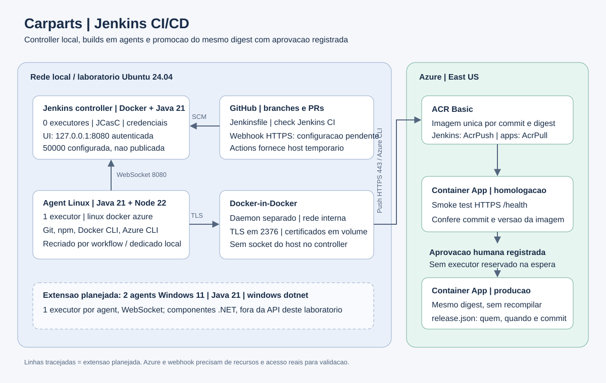

# E1 - Arquitetura e justificativa

O controller Jenkins fica local, em container Docker com Java 21, dados persistidos em volume e **zero executores**. Ele armazena configuracao, credenciais e historico, agenda jobs e oferece a interface. O acesso local usa `127.0.0.1:8080` com autenticacao obrigatoria; a porta 8080 nao e publicada na internet.

O laboratorio usa um agent Linux em container Debian sobre host Ubuntu 24.04, com Java 21, Node.js 22, Git, Docker CLI e Azure CLI. Tem **um executor** e rotulos `linux docker azure`. Ele conecta ao controller por WebSocket pela rede Docker interna, dispensando expor a porta 50000. Docker-in-Docker tem daemon separado e TLS na porta **2376 somente interna**; nao se monta o socket Docker do host no controller. O container DinD e privilegiado, por isso esse laboratorio deve ficar isolado de cargas de producao e de usuarios nao confiaveis.

No parque da Carparts, o host pode ser uma das estacoes Ubuntu 24.04 ou Windows 11 com WSL 2. Um segundo agent Linux pode atender picos, sempre com um executor por instancia. Os dois agents Windows 11 previstos para componentes .NET teriam Java 21, rotulo `windows dotnet`, um executor e conexao WebSocket. Eles sao uma extensao projetada; nao sao criados nem usados pela API Node deste laboratorio.

Os agents sao recriados a cada execucao do workflow GitHub Actions. A composicao local mantem um agent dedicado enquanto o laboratorio estiver ligado. Builds de PR executam apenas CI, sem credenciais Azure. PRs de forks nao sao descobertos automaticamente nesta configuracao, para evitar executar codigo externo com permissao de laboratorio.

Homologacao e producao usam Azure Container Apps Consumption, ambos puxando do ACR Basic por identidade gerenciada com `AcrPull`. Um service principal do Jenkins tem `AcrPush` limitado ao registro e `Contributor` limitado a cada Container App; a assinatura e o tenant ficam no cofre de credenciais do Jenkins. Nao precisa criar ou apagar grupos de recursos a cada build.

A escolha local em Docker atende ao Jenkins autogerenciado e mantem o ERP on-premises, sem transmitir dados do ERP no projeto. O custo de nuvem se concentra no ACR e nos apps. VM Azure e AKS acrescentariam custo e operacao sem necessidade para a equipe de quatro desenvolvedores.

O diagrama distingue a rede local dos servicos Azure. O webhook real requer um endereco HTTPS permanente, proxy reverso/tunel aprovado e acesso restrito; o Jenkins temporario do runner nao e um endpoint publico persistente.

Referencia: [Jenkins - agents e executores](https://www.jenkins.io/doc/book/using/using-agents/).
